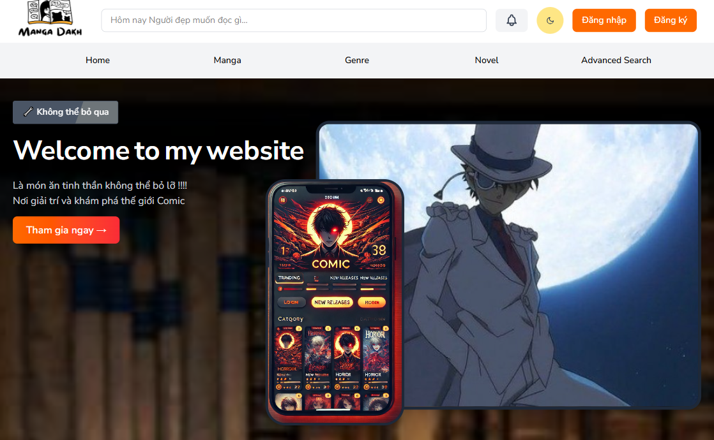
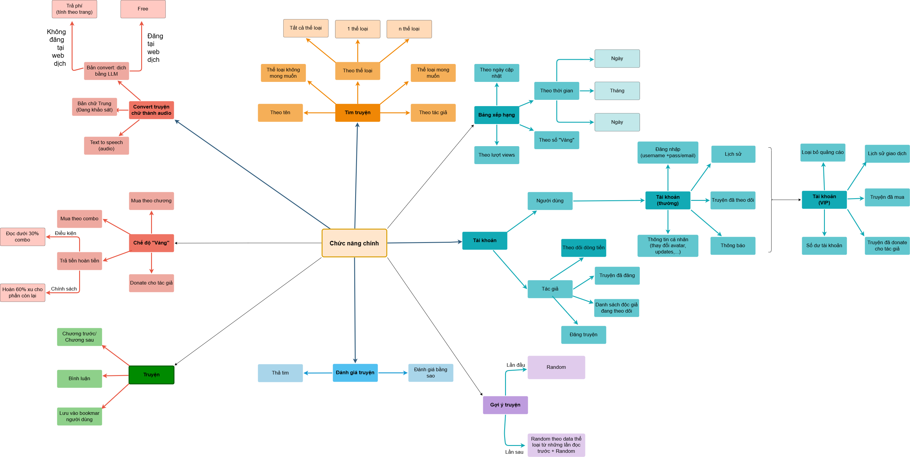

---

# Nền tảng CNA

Một website đầy đủ tính năng dành cho Truyện tranh, Tiểu thuyết và Sách nói.

---
# Tổng hợp đồ án môn học Nhóm 3 chủ đề Website đọc truyện

## Thành viên:
| Họ và tên    | MSSV     |
| ------------ | -------- |
| Phạm Thanh An | 23520027 |
| Nguyễn Ngọc Diệu Duyên  | 23520401 |
| Đoàn Việt Khải    | 23520673 |

## Source code: 
Link github của source code web: [Link](https://github.com/AhnMaph/comics-website)

## Video phỏng vấn PR Website:
Tiktok: [Link](https://www.tiktok.com/@cantevenusemyrealname/video/7519089829850647809)

## Website deploy internet:
Website: [mangadakh](https://mangadakh.up.railway.app/)

## Video demo website :
Demo: [Link](https://drive.google.com/drive/folders/1uAf40Ym1mrhGfIhkM4IOZ5aE4plVi9qF?usp=sharing)

## Voice Cloning Model:
Demo: [Link](https://drive.google.com/drive/u/4/folders/1TyTrSdCOm37T7NzFg8UTiK3tynRTgmxv)

## Giới thiệu:  

✨ **mangadakh** ✨ – Nền tảng đọc truyện trực tuyến với nhiều tính năng ưu việt!  
📚 Tại đây, bạn có thể thỏa sức khám phá kho truyện phong phú với hàng ngàn đầu truyện hấp dẫn: 

>🎨 Truyện tranh sinh động, sắc nét  
>✍️ Truyện chữ lôi cuốn, dễ đọc  
>💡 Đặc biệt, AI, biến truyện chữ thành giọng đọc tiếng Việt tự nhiên 🎧, giúp bạn dễ dàng nghe truyện mọi lúc, mọi nơi như đang thưởng thức sách nói!  

🎉 Trải nghiệm ngay tại [mangadakh](https://mangadakh.up.railway.app/) để bước vào thế giới truyện đầy màu sắc, sinh động và tiện ích! 
    


## Công nghệ website:  

💻 **Frontend**: Typescript, Vite, Tailwind CSS  
⚙️ **Backend**: Django  
🗄️ **Database**: SQLite (Develop), PostgreSQL (Deploy)

## Sơ đồ tính năng mong muốn:  



## Tính năng:  

📚 **Truyện tranh** (manga, có hình ảnh minh họa)  
📖 **Tiểu thuyết** (truyện văn bản thuần túy)
🎧 **Sách nói** (truyện chữ thành audio)    
⭐ **Chức năng truyện** (like truyện, yêu thích (lưu) truyện, đánh giá)  
🔔 **Thông báo** (được trả lời comment, truyện yêu thích cập nhật chương mới)  
🧑 **User Profile** (lưu truyện yêu thích, thay đổi ảnh đại diện)  
🔍 **Advance Search** (tìm kiếm nâng cao, nhiều thể loại một lúc, chọn thể loại yêu thích, và thể loại không thích) 

## Hướng phát triển thêm:  

🛠️ **Hệ thống VIP**: Nạp tiền, người dùng free, người dùng có vàng.  
🛠️ **Phân loại người dùng**: Tác giả (Đăng truyện), Người dùng thường, Người dùng VIP.  
🛠️ **Bảng xếp hạng truyện hot**: Theo lượt views.  

## Video:  
🎬 **Demo**: [Link](https://drive.google.com/drive/u/4/folders/1uAf40Ym1mrhGfIhkM4IOZ5aE4plVi9qF)  
🎬 **Trải nghiệm sản phẩm**:  [Tiktok](https://www.tiktok.com/@cantevenusemyrealname/video/7519089829850647809?is_from_webapp=1&sender_device=pc)  

---

## Cấu trúc Dự án

```
├── backend/      # Backend Django
├── frontend/     # Frontend React/TypeScript
├── docker-compose.yml
├── Makefile      # Tự động hóa quy trình làm việc với Docker và local
└── README.md
```

---

## 1. Cài đặt Môi trường

### Yêu cầu trước

* [Docker](https://docs.docker.com/get-docker/) & [Docker Compose](https://docs.docker.com/compose/install/) (khuyến nghị)
* Hoặc: Python 3.8+, Node.js 18+, npm 9+ (nếu phát triển local)

### Clone repository

```bash
git clone https://github.com/AhnMaph/comics-website.git
cd comics-website
```

### Biến môi trường

#### a. Chạy demo local

Tạo file `.env` trong thư mục `backend` với nội dung tối thiểu:

```
SUPERUSER_USERNAME=your_username
SUPERUSER_EMAIL=your_email
SUPERUSER_PASSWORD=your_password
```

Tạo file `.env` trong thư mục `frontend` với nội dung tối thiểu:

```
VITE_ADMIN_URL=http://localhost:8000
VITE_FRONTEND_URL=http://localhost:5174
```

#### b. Chạy demo với Docker

Tạo thêm một file `.env` ở thư mục gốc của dự án với nội dung tối thiểu:

```
SUPERUSER_USERNAME=your_username
SUPERUSER_EMAIL=your_email
SUPERUSER_PASSWORD=your_password
VITE_ADMIN_URL=http://localhost:8000
VITE_FRONTEND_URL=http://localhost:5174
```

---

## 2. Sử dụng Makefile

Tất cả tác vụ phổ biến đã được tự động hóa thông qua `Makefile`. Chạy `make help` để xem tất cả lệnh có sẵn.

### Phát triển local (không dùng Docker)

* **Khởi động backend:**

  ```bash
  make run-backend
  ```

  Chạy Django tại [http://127.0.0.1:8000/](http://127.0.0.1:8000/)

* **Khởi động frontend:**

  ```bash
  make run-frontend
  ```

  Chạy React tại [http://127.0.0.1:5174/](http://127.0.0.1:5174/)

* **Chạy migrate database:**

  ```bash
  make migrate
  ```

* **Tạo migration mới:**

  ```bash
  make makemigrations
  ```

* **Thêm dữ liệu demo:**

  ```bash
  make add-demo-data
  ```

> **Lưu ý:** Với môi trường local, cần cài dependency trước:
>
> * Backend: `pip install -r backend/requirements.txt`
> * Frontend: `cd frontend && npm install`

---

### Phát triển với Docker

* **Khởi động toàn bộ dịch vụ (và build nếu cần):**

  ```bash
  make up
  ```

* **Dừng và xóa container/volume:**

  ```bash
  make down
  ```

* **Khởi động lại dịch vụ:**

  ```bash
  make restart
  ```

* **Xem log:**

  ```bash
  make logs
  ```

* **Mở shell trong container backend:**

  ```bash
  make shell-backend
  ```

* **Mở shell trong container frontend:**

  ```bash
  make shell-frontend
  ```

* **Dọn dẹp toàn bộ:**

  ```bash
  make clean
  ```

* **Build lại mọi thứ:**

  ```bash
  make rebuild
  ```

---

## 3. Truy cập Website

* **Backend:** [http://127.0.0.1:8000/](http://127.0.0.1:8000/)
* **Frontend:** [http://127.0.0.1:5174/](http://127.0.0.1:5174/)

---

## 4. Xử lý sự cố

* Dùng `make logs` để xem log.
* Dùng `make clean-port` nếu cổng 8000/5174 đang bị chiếm.
* Dùng `make prune` để xóa dữ liệu Docker không sử dụng.

---

## 5. Ghi chú thêm

* Dùng `make help` để xem thêm lệnh.
* Đảm bảo file `.env` của bạn đã được thiết lập để tạo admin.
---

Chúc bạn đọc truyện và nghe sách vui vẻ!

---

